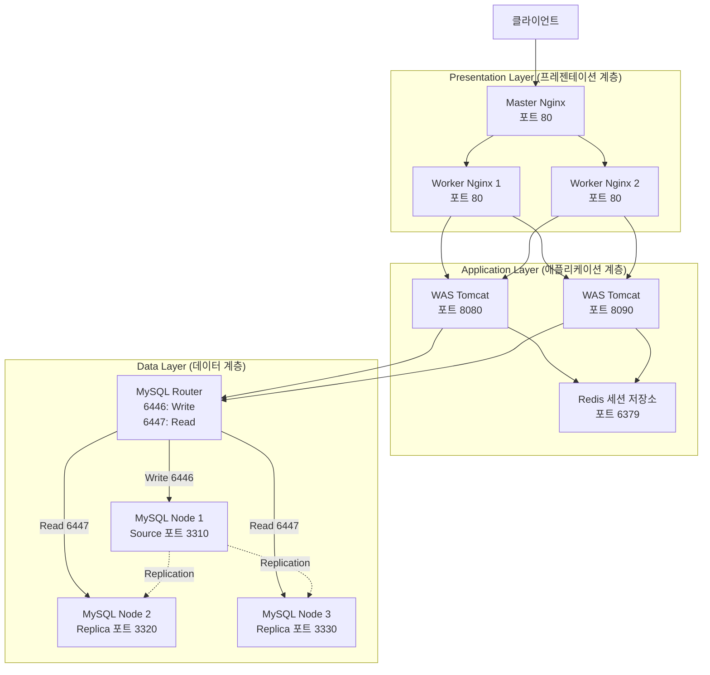
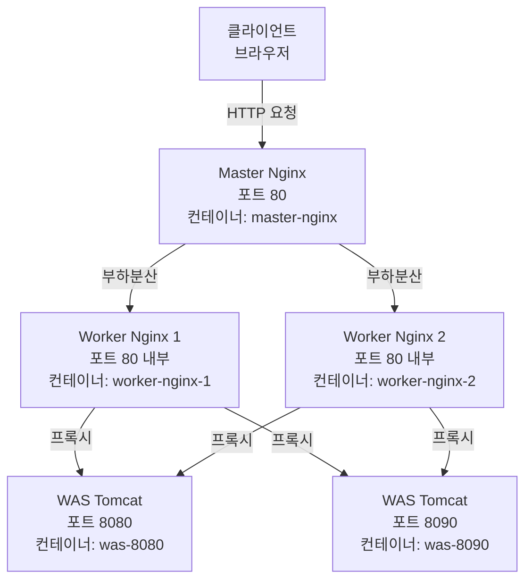
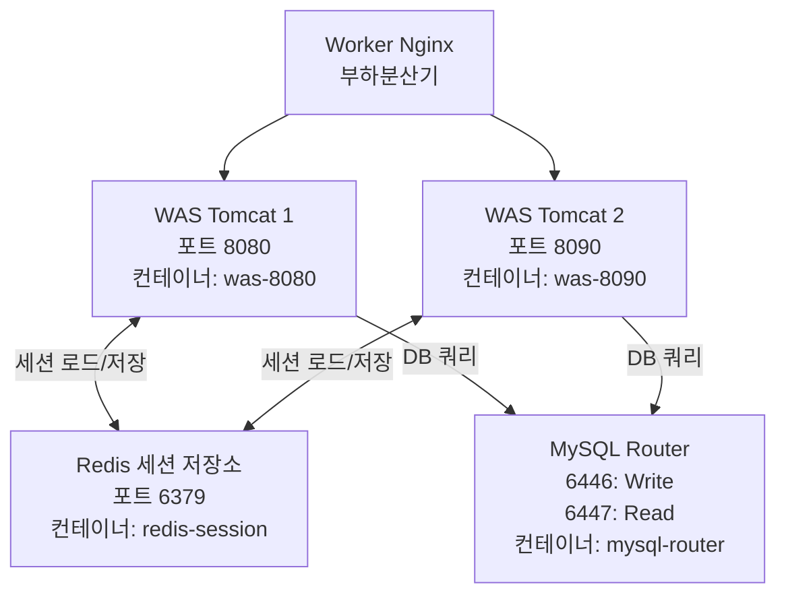
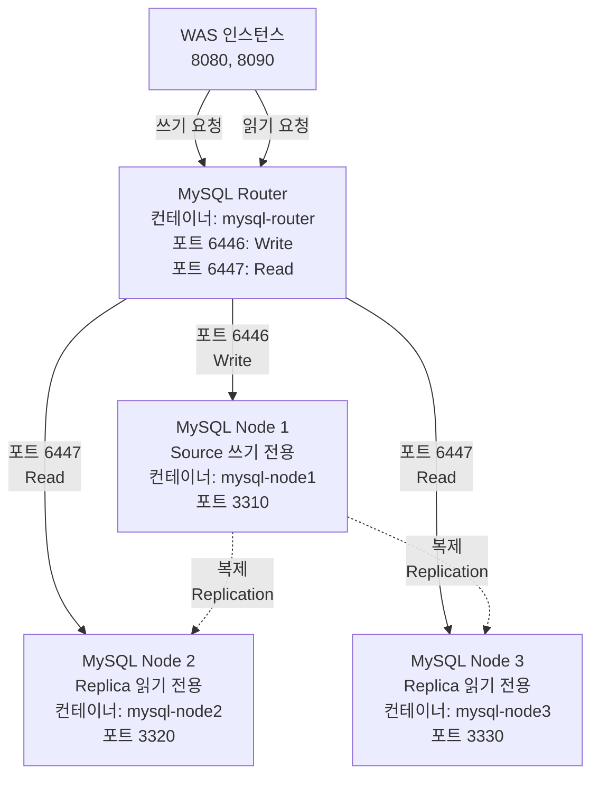

# 📊 3-Tier Architecture - Card Transaction System

> Docker 컨테이너 기반 3-tier 아키텍처로 구현된 분기별 카드 거래내역 조회 시스템


## ✨ 주요 특징

- 🔄 **이중 부하분산**: Master Nginx → Worker Nginx(2개) 구조
- 🔐 **세션 공유**: Redis 기반 WAS 간 세션 동기화
- 📚 **읽기/쓰기 분리**: MySQL Router를 통한 데이터베이스 부하 분산
- 🐳 **컨테이너화**: Docker Compose 기반 원클릭 배포

---

## 🏗️ 시스템 아키텍처

### 전체 구조 다이어그램



### 요청 처리 흐름

1. **클라이언트 요청** → HTTP 요청 전송 (포트 80)
2. **Master Nginx** → 2개의 Worker Nginx로 부하분산
3. **Worker Nginx** → 2개의 WAS 인스턴스로 부하분산
4. **WAS 필터 체인** → RedisSessionFilter → LoginSessionCheckFilter → EncodingFilter
5. **비즈니스 로직** → Servlet 처리 + MySQL Router 접근
6. **데이터베이스** → 쓰기(6446→Source) / 읽기(6447→Replica)
7. **응답 반환** → 역순으로 클라이언트에게 전달

---

## 🛠️ 기술 스택

| 계층 | 기술 | 버전 |
|------|------|------|
| **Web Server** | Nginx | Alpine |
| **Application Server** | Apache Tomcat | 9 (JDK 17) |
| **Language** | Java | 17 |
| **Session Store** | Redis | Alpine |
| **Database** | MySQL | 8.0 |
| **DB Router** | MySQL Router | 8.0 |
| **Container** | Docker & Docker Compose | - |

---

## 📦 계층별 상세 구조

## 1️⃣ Presentation Layer (프레젠테이션 계층)

### 아키텍처 다이어그램



### 컴포넌트 설명

#### 🔹 Master Nginx
- **역할**: 외부 클라이언트 요청의 진입점 및 1차 부하분산
- **포트**: `80`
- **인스턴스**: 1개
- **컨테이너**: `master-nginx`

#### 🔹 Worker Nginx
- **역할**: Master Nginx로부터 받은 요청을 WAS로 2차 부하분산
- **포트**: `80` (내부)
- **인스턴스**: 2개 (`worker-nginx-1`, `worker-nginx-2`)

### 핵심 설정 파일

<details>
<summary><b>📄 docker/nginx/master-nginx.conf</b> (클릭하여 펼치기)</summary>

```nginx
events {
    worker_connections 1024;
}

http {
    # upstream: 백엔드 서버 그룹
    upstream web-cluster {
        server worker-nginx-1:80;
        server worker-nginx-2:80;
    }

    server {
        listen 80;
        server_name localhost;

        location / {
            proxy_pass http://web-cluster;

            proxy_set_header Host $host;
            proxy_set_header X-Real-IP $remote_addr;
            proxy_set_header X-Forwarded-For $proxy_add_x_forwarded_for;
        }
    }
}
```

**핵심 파라미터:**
- `upstream web-cluster`: Worker Nginx 그룹 정의
- `proxy_pass`: upstream으로 요청 전달
- `proxy_set_header`: 클라이언트 정보 헤더 전달

</details>

<details>
<summary><b>📄 docker/nginx/nginx.conf</b> (클릭하여 펼치기)</summary>

```nginx
events {
    worker_connections 1024;
}

http {
    # upstream: 백엔드 서버 그룹
    upstream was-cluster {
        server was-8080:8080;
        server was-8090:8080;
    }

    server {
        listen 80;
        server_name localhost;

        location / {
            # 모든 요청을 was-cluster로 전달
            proxy_pass http://was-cluster;

            proxy_set_header Host $host;
            proxy_set_header X-Real-IP $remote_addr;
            proxy_set_header X-Forwarded-For $proxy_add_x_forwarded_for;
        }
    }
}
```

**핵심 파라미터:**
- `upstream was-cluster`: WAS 그룹 정의
- `server was-8080:8080`, `server was-8090:8080`: WAS 인스턴스
- `proxy_pass`: upstream으로 요청 전달

</details>

---

## 2️⃣ Application Layer (애플리케이션 계층)

> Java Servlet 기반 WAS 2개 인스턴스가 Redis를 통해 세션을 공유하며, MySQL Router를 통해 데이터베이스에 접근

### 아키텍처 다이어그램



### 컴포넌트 설명

#### 🔹 WAS (Web Application Server)
- **역할**: Tomcat 기반 Java Servlet 애플리케이션 서버
- **컨테이너**: `was-8080`, `was-8090`
- **포트**:
    - `was-8080`: `8080:8080`
    - `was-8090`: `8090:8080`
- **WAR 파일**: `card-history-3tier-system.war`

#### 🔹 Redis
- **역할**: WAS 간 세션 공유를 위한 중앙 저장소
- **포트**: `6379`
- **컨테이너**: `redis-session`

### Servlet

<details>
<summary><b>🔹 1. LoginServlet</b></summary>

**파일**: `src/main/java/dev/controller/servlet/user/LoginServlet.java`

**역할**: 사용자 번호를 통한 로그인 처리

**핵심 로직**:
```java
// 1. 기존 세션 확인 및 재사용/폐기
HttpSession existingSession = request.getSession(false);
if (existingSession != null) {
    // 같은 유저면 세션 재사용, 다른 유저면 기존 세션 폐기
}

// 2. Replica DataSource로 사용자 검증 (읽기)
DataSource ds = ApplicationContextListener.getReplicaDataSource(getServletContext());

// 3. DB 조회 후 로그인 성공 시 세션 생성
if (사용자 존재) {
    HttpSession session = request.getSession();
    session.setAttribute("loggedInUser", userId);
    response.sendRedirect("/index.html");
}
```

</details>

<details>
<summary><b>🔹 2. LogoutServlet</b></summary>

**파일**: `src/main/java/dev/controller/servlet/user/LogoutServlet.java`

**역할**: 로그아웃 처리 및 세션/쿠키 완전 삭제

**핵심 로직**:
```java
// 1. 뒤로가기 방지 헤더 설정
response.setHeader("Cache-Control", "no-cache, no-store, must-revalidate");

// 2. 세션 무효화
session.invalidate();

// 3. 모든 쿠키 삭제
for (Cookie cookie : cookies) {
    cookie.setMaxAge(0);
    response.addCookie(cookie);
}
```

</details>

<details>
<summary><b>🔹 3. ReportMonthsServlet</b></summary>

**파일**: `src/main/java/dev/controller/servlet/payment_amount/ReportMonthsServlet.java`

**역할**: 사용자의 세션과 분기코드를 통해 소비 내역 조회

**핵심 로직**:
```java
// 1. 세션에서 사용자 정보 추출
String userNo = (String) session.getAttribute("loggedInUser");
String date = request.getParameter("date");

// 2. Replica DataSource로 거래 내역 조회 (읽기)
DataSource ds = ApplicationContextListener.getReplicaDataSource(getServletContext());

// 3. Builder 패턴으로 VO 생성 후 JSON 응답
CardTransactionVO transaction = CardTransactionVO.builder()
    .(...)
    .build();
out.print(new Gson().toJson(transaction));
```

</details>

<details>
<summary><b>🔹 4. PaymentDatesServlet</b></summary>

**파일**: `src/main/java/dev/controller/servlet/user/PaymentDatesServlet.java`

**역할**: 사용자의 세션을 통해 결제가 있었던 분기코드 목록 조회

**핵심 로직**:
```java
// 1. 세션에서 사용자 정보 추출
String userNo = (String) session.getAttribute("loggedInUser");

// 2. Replica DataSource로 분기코드 목록 조회 (읽기)
DataSource ds = ApplicationContextListener.getReplicaDataSource(getServletContext());

// 3. 분기코드 리스트를 JSON 배열로 응답
List<String> dates = new ArrayList<>();
// ... DB 조회 후 리스트 채우기
out.print(new Gson().toJson(dates));
```

</details>

<details>
<summary><b>🔹 5. AddFixedCostServlet</b></summary>

**파일**: `src/main/java/dev/controller/servlet/fixed_cost/AddFixedCostServlet.java`

**역할**: 사용자가 선택한 분기의 특정 과목 결제 금액 변경

**핵심 로직**:
```java
// 1. 세션 및 파라미터 추출
String userNo = (String) session.getAttribute("loggedInUser");
long cost = Long.parseLong(request.getParameter("cost"));
String category = request.getParameter("category");

// 2. Source DataSource로 금액 업데이트 (쓰기)
DataSource ds = ApplicationContextListener.getSourceDataSource(getServletContext());

// 3. UPDATE 실행 후 성공 여부 반환
int result = pstmt.executeUpdate();
boolean isSuccess = (result == 1);
out.print(isSuccess);
```

</details>

### 필터 체인 (Filter Chain)

```
요청 → RedisSessionFilter → LoginSessionCheckFilter → EncodingFilter → Servlet
```

<details>
<summary><b>🔹 1. RedisSessionFilter</b></summary>
**파일**: `src/main/java/dev/filter/RedisSessionFilter.java`

**역할**: WAS의 세션을 Redis로 위임하여 세션 공유 구현

**주요 기능**:
- 쿠키에서 세션 ID 추출 (`REDIS_SESSION_ID`)
- Redis에서 세션 데이터 로드/저장

**핵심 로직**:
```java
// Redis 접속 정보 및 Cookie 이름 지정
private static final String REDIS_HOST = "redis-session";
private static final int REDIS_PORT = 6379;
private static final String COOKIE_NAME = "REDIS_SESSION_ID";
```

</details>

<details>
<summary><b>🔹 2. LoginSessionCheckFilter</b></summary>
**파일**: `src/main/java/dev/filter/LoginSessionCheckFilter.java`

**역할**: 로그인 세션 유효성 검증

**주요 기능**:
- 세션에 `loggedInUser` 속성 존재 여부 확인
- 로그인되지 않은 사용자는 로그인 페이지로 리다이렉트

**제외 경로**: `/login.html`, `/login`, `/static/*`, `*.css`, `*.js`

**핵심 로직**:
```java
// 세션 검증 및 처리
HttpSession session = request.getSession(false);
if (session != null && session.getAttribute("loggedInUser") != null) {
    chain.doFilter(request, response);
} else {
    response.sendRedirect("/login.html");
}
```

</details>

<details>
<summary><b>🔹 3. EncodingFilter</b></summary>

**파일**: `src/main/java/dev/filter/EncodingFilter.java`

**역할**: 요청/응답 인코딩을 UTF-8로 설정하여 한글 깨짐 방지

</details>

### 데이터베이스 연결 (DataSource)

<details>
<summary><b>📄 ApplicationContextListener.java</b> (클릭하여 펼치기)</summary>
**파일**: `src/main/java/dev/common/ApplicationContextListener.java`

**역할**: HikariCP 기반 커넥션 풀 관리 및 읽기/쓰기 분리

#### Source DataSource (쓰기 전용)
```java
sourceConfig.setJdbcUrl("jdbc:mysql://mysql-router:6446/card_db");
sourceConfig.setReadOnly(false);
sourceConfig.setPoolName("SourcePool");
```

#### Replica DataSource (읽기 전용)
```java
replicaConfig.setJdbcUrl("jdbc:mysql://mysql-router:6447/card_db");
replicaConfig.setReadOnly(true);
replicaConfig.setMaximumPoolSize(20);
replicaConfig.setPoolName("ReplicaPool");
```

**Servlet에서 사용**:
```java
// 쓰기 작업
DataSource ds = ApplicationContextListener.getSourceDataSource(getServletContext());

// 읽기 작업
DataSource ds = ApplicationContextListener.getReplicaDataSource(getServletContext());
```

</details>

---

## 3️⃣ Data Layer (데이터 계층)

> MySQL Cluster 기반 데이터 저장 및 MySQL Router를 통한 읽기/쓰기 분리

### 아키텍처 다이어그램



### 컴포넌트 설명

#### 🔹 MySQL Router
- **역할**: 읽기/쓰기 요청을 적절한 MySQL 노드로 라우팅
- **포트**:
    - `6446` (Write → Source)
    - `6447` (Read → Replica)
- **컨테이너**: `mysql-router`

#### 🔹 MySQL Node 1 (Source)
- **역할**: 쓰기 전용 마스터 노드
- **포트**: `3310:3306`
- **컨테이너**: `mysql-node1`

#### 🔹 MySQL Node 2, 3 (Replica)
- **역할**: 읽기 전용 슬레이브 노드
- **포트**: `3320:3306`, `3330:3306`
- **컨테이너**: `mysql-node2`, `mysql-node3`

### 핵심 설정 파일

<details>
<summary><b>📄 docker/mysql/node1.cnf</b> (Source 노드)</summary>

```ini
[mysqld]
server-id=1
log-bin=mysql-bin
gtid-mode=ON
enforce-gtid-consistency=ON
binlog-format=ROW
log-slave-updates=ON
report-host=mysql-node1
```

**핵심 파라미터**:
- `server-id=1`: 클러스터 내 고유 식별자
- `gtid-mode=ON`: GTID 기반 복제 활성화
- `binlog-format=ROW`: 행 단위 복제

</details>

<details>
<summary><b>📄 docker/mysql/node2.cnf</b> (Replica 노드)</summary>

```ini
[mysqld]
server-id=2
log-bin=mysql-bin
gtid-mode=ON
enforce-gtid-consistency=ON
binlog-format=ROW
log-slave-updates=ON
report-host=mysql-node2
```

**핵심 파라미터**:
- `server-id=2`: 클러스터 내 고유 식별자
- `log-slave-updates=ON`: 복제받은 변경사항도 Binary Log에 기록

</details>

<details>
<summary><b>📄 docker/mysql/node3.cnf</b> (Replica 노드)</summary>

```ini
[mysqld]
server-id=3
log-bin=mysql-bin
gtid-mode=ON
enforce-gtid-consistency=ON
binlog-format=ROW
log-slave-updates=ON
report-host=mysql-node3
```

</details>

### 복제 설정 예시

<details>
<summary><b>🔧 Replication 설정 SQL</b> (클릭하여 펼치기)</summary>

```sql
-- Source 노드에서 복제 사용자 생성
CREATE USER 'repl'@'%' IDENTIFIED BY 'password';
GRANT REPLICATION SLAVE ON *.* TO 'repl'@'%';

-- Replica 노드에서 복제 설정
CHANGE MASTER TO
  MASTER_HOST='mysql-node1',
  MASTER_USER='repl',
  MASTER_PASSWORD='password',
  MASTER_AUTO_POSITION=1;

START SLAVE;
```

</details>

---

## 🐛 트러블슈팅

<details>
<summary><b>MySQL Cluster 연결 실패</b></summary>

1. MySQL 노드가 모두 실행 중인지 확인

    ```bash
   docker-compose ps | grep mysql
   ```

2. MySQL Router 로그 확인
   ```bash
   docker logs mysql-router
   ```

3. Replication 상태 확인
   ```bash
   docker exec mysql-node2 mysql -u root -p -e "SHOW SLAVE STATUS\G"
   ```

</details>

<details>
<summary><b>세션이 공유되지 않음</b></summary>

1. Redis 컨테이너 상태 확인
   ```bash
   docker-compose ps redis-session
   ```

2. Redis 연결 테스트
   ```bash
   docker exec -it redis-session redis-cli PING
   ```

3. WAS 로그에서 Redis 연결 오류 확인
   ```bash
   docker logs was-8080 | grep -i redis
   ```

</details>

---
